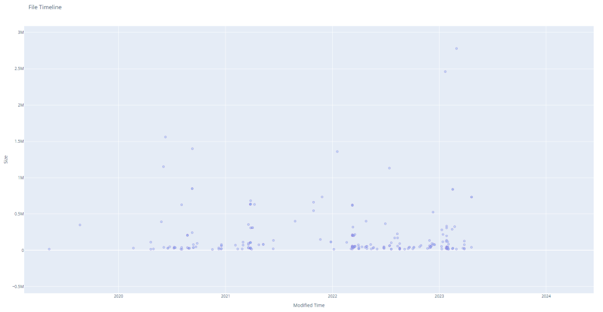
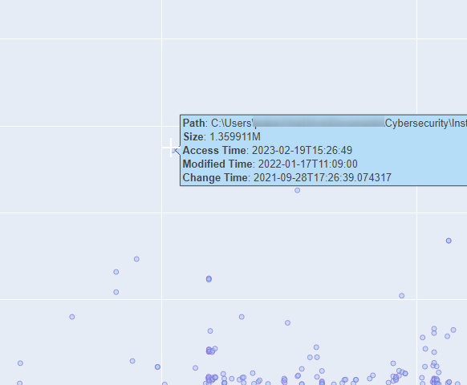

# File Timeliner

This script generates a timeline of files in a specified folder, optionally sorting and filtering the files based on user-provided criteria. The output is stored in a CSV file with the following columns: Path, Size, Access Time, Modification Time, and Change Time.

## Installation

The script uses standard Python 3 libraries.

1. Clone the repository:
```text
git clone https://github.com/dfirsec/file_timeliner.git
```

2. Change to the project directory:
```text
cd file_timeliner
```

3. Install required packages using poetry:

```text
poetry install
```

## Usage

1. Create the virtual environment

```text
poetry shell
```

2. Run using the following commands:

```text
python file_timeliner.py [PATH] [OPTIONS]
```

### Arguments

**PATH**: The path to the folder for which you want to create the file timeline.

### Options

`--output (-o)`: The output file path. If not specified, the output will be stored in a file named filetimeline.csv in the same folder as the script.

`--graph, (-g)`: Generate a graph of file sizes over time

`--human-readable (-H)`: Display times in human-readable format.

`--sort (-s)`: Sort files by Access Time (atime), Modification Time (mtime), or Change Time (ctime).

`--max-depth (-d)`: Maximum depth of recursion in subdirectories. By default, the script will search all subdirectories.

`--filter-extension (-e)`: Filter files by the specified file extension (e.g., '.txt').

```text
positional arguments:
  PATH                  Path of the folder to create the timeline

options:
  -h, --help            show this help message and exit
  --output OUTPUT, -o OUTPUT
                        Output file path
  --graph, -g           Generate a graph of file sizes over time
  --human-readable, -H  Display times in human-readable format
  --sort {atime,mtime,ctime}, -s {atime,mtime,ctime}
                        Sort by Access Time (atime), Modified Time (mtime), or Change Time (ctime)
  --max-depth MAX_DEPTH, -d MAX_DEPTH
                        Maximum depth of recursion in subdirectories
  --filter-extension FILTER_EXTENSION, -e FILTER_EXTENSION
                        Filter files by the specified file extension (e.g., '.txt')
```

## Create a timeline of files

### Example

`python file_timeliner.py "<PATH>" -s mtime -H -d 2 -e .pdf -g`

This will generate a timeline of files in the specified folder, sorted by modification time, with human-readable times, limited to a depth of 2 subdirectories, only including files with the .pdf extension, and plotting a graph of file sizes over time.






## Contributing

Contributions are welcome! If you find any issues or have suggestions for improvement, please create an issue or submit a pull request.

### License

This project is licensed under the terms of the MIT license.
